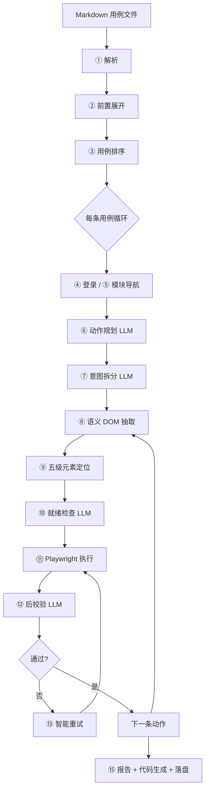

# UI 自动化框架说明（领导速览版）

> **一句话定位**：测试人员用中文 Markdown 写用例，框架自动登录、导航、操作浏览器并校验结果；**规划与判断主要靠大模型，执行与定位尽量靠规则与缓存**，兼顾「低代码」与「可回归」。

---

## 1. 解决什么问题

| 传统 UI 自动化 | 本框架 |
|----------------|--------|
| 测试要写 Playwright/Selenium 代码、维护选择器 | 用例是自然语言步骤 + 预期，**不写代码** |
| 页面改版后脚本大面积失效 | 五级定位链 + 后校验重试，**自愈能力** |
| 业务知识散落在脚本里 | 业务 API、角色、枚举放在 `业务知识.md`，**框架通用、业务可插拔** |
| 失败难排查 | 每步落盘 DOM 快照、LLM 原始响应、执行追踪、HTML 报告 |

---

## 2. 端到端流程



### 阶段说明（按执行顺序）

| 步骤 | 名称 | 是否用 LLM | 作用 |
|------|------|:----------:|------|
| ① | 用例解析 | 否 | 把 Markdown 拆成结构化用例（编号、模块路径、前置、步骤、预期） |
| ② | 前置条件展开 | **可选** | 把「已有收货地址」等状态型前置展开为操作步骤；有 API 前置时优先走接口 |
| ③ | 用例排序 | **可选** | 推断用例间依赖并拓扑排序；默认关闭，多用例时可开启 |
| ④ | 自动登录 | 否 | 按业务角色 / 配置账号登录，支持跨用例会话复用 |
| ⑤ | 模块导航 | 否 | 按 `# / ## / ###` 模块路径逐级点菜单 |
| ⑥ | 动作规划 | **是（每 case 1 次）** | 把自然语言步骤翻译成 `{类型, 意图, 值}`，**不产出选择器** |
| ⑦ | 意图拆分 | **是（每 case 0~1 次）** | 复合句拆原子动作；无复合动作时跳过 LLM |
| ⑧ | 语义 DOM | 否 | 实时抓取页面可交互元素摘要（弹窗/表单优先） |
| ⑨ | 五级定位 | **按需（L5）** | 缓存→记忆→规则→学习→大模型，命中高层则不调 LLM |
| ⑩ | 就绪检查 | **是（推进类步骤）** | 提交/保存等关键操作前判断页面是否就绪，给出恢复动作 |
| ⑪ | 动作执行 | 否 | Playwright 点击/输入/断言/API 调用等 |
| ⑫ | 后校验 | **是（操作类步骤）** | 判断「真的点对了吗」，防假操作 |
| ⑬ | 智能重试 | 间接 | 按后校验建议改值/换元素；弹窗阻挡时先规则关窗再调就绪 LLM |
| ⑮ | 汇总输出 | 否 | HTML 报告、执行日志、可观测性 JSON、Playwright 脚本生成 |

---

## 3. LLM 使用全景

### 3.1 固定调用（规划阶段，每个用例）

| 环节 | 调用频率 | 输入 | 输出 |
|------|----------|------|------|
| **动作规划** `action_plan` | **每 case 1 次** | 前置、步骤、预期、业务角色、当前 URL | 结构化动作列表（click/fill/assert/api_call 等） |
| **意图拆分** `intent_split` | **每 case 0~1 次** | 整份规划动作列表 | 复合动作拆成原子步骤 |

> 典型 10 步用例：规划阶段约 **1~2 次** LLM 调用。

### 3.2 执行阶段（按步骤、按命中情况）

| 环节 | 调用频率 | 触发条件 |
|------|----------|----------|
| **元素决策** `element_decide` | 每步 0~1 次 | 五级链 L1~L4 均未命中时（L5） |
| **就绪检查** `readiness` | 推进类步骤前 | 提交/保存/goto 等；或上一步后校验失败需恢复 |
| **后校验** `post_check` | 每步操作后 0~1 次 | `post_step_check=true` 且为可校验操作 |
| **语义断言** `semantic_assert` | 断言失败时兜底 | 精确文本匹配失败后的语义判断 |
| **前置展开** `precondition` | 每文件 0~N 次 | 无 API 前置、需文本展开时 |
| **用例排序** `case_sort` | 每文件 0~1 次 | `case_sort_llm=true` 且多用例 |

### 3.3 单次用例 LLM 调用量（估算）

| 场景 | 规划 | 执行（首次跑） | 执行（二次跑，缓存命中高） |
|------|------|----------------|---------------------------|
| 简单 5 步 | 1~2 次 | 5~15 次（定位 L5 + 后校验） | 2~8 次（后校验为主） |
| 复杂 20 步 | 1~2 次 | 20~60 次 | 5~20 次 |

**智能加速**（`智能加速/` 目录）会在 L5 成功后回填 L1/L2/L4，**二次运行 LLM 调用显著下降**。

### 3.4 不用 LLM 的关键能力

- 用例 Markdown 解析、登录、菜单导航
- API/数据库调用（`业务知识.md` 配置）
- 五级链 L1 缓存 / L2 记忆 / L3 规则引擎 / L4 结构学习
- 弹窗规则关闭（红线协议 checkbox 等）
- Playwright 脚本生成（基于实际执行轨迹）

---

## 4. 核心架构分层

```
┌─────────────────────────────────────────┐
│  用例层：Markdown + 业务知识.md          │  ← 测试/业务同学维护
├─────────────────────────────────────────┤
│  规划层：动作规划 + 意图拆分 (LLM)       │  ← 自然语言 → 结构化意图
├─────────────────────────────────────────┤
│  定位层：五级链 + 语义 DOM               │  ← 意图 → 页面元素
├─────────────────────────────────────────┤
│  可靠性层：就绪检查 + 后校验 + 重试 (LLM) │  ← 防假操作、弹窗恢复
├─────────────────────────────────────────┤
│  执行层：Playwright + API Runner         │  ← 真正操作浏览器/接口
├─────────────────────────────────────────┤
│  输出层：报告 / 追踪 / 代码生成 / 加速库  │  ← 可审计、可回归
└─────────────────────────────────────────┘
```

### 业务扩展方式（框架与业务解耦）

- 用例放在 `业务/<系统>/<项目>/cases/*.md`
- 接口、角色、枚举、会话字段写在同级 `业务知识.md`
- 框架 `core/` **不写死具体业务**；新系统只需新增业务目录

---

## 5. 优势

### 5.1 对测试团队

1. **门槛极低**：会写中文用例即可，无需学 Playwright 语法
2. **改版韧性**：选择器由运行时动态决策，配合缓存与学习越跑越稳
3. **防假通过**：后校验让模型判断「操作是否产生预期效果」，减少「点到了但业务没变」
4. **全链路可观测**：每步 DOM、LLM 提示词、原始响应、执行追踪均可落盘，方便复盘

### 5.2 对工程与质量

1. **可回归**：执行成功后会生成 `playwright_*.py` 脚本，可纳入 CI 做确定性回归
2. **可服务化**：提供 FastAPI REST + 本地有头代理，支持远程调度
3. **提示词可治理**：`prompts/*.md` 与 `config.yaml` 可覆盖，规则迭代不需改代码
4. **混合自动化**：同一条用例可交错 UI 步骤与 API/DB 调用（投放、查工单等）

### 5.3 对成本与演进

1. **LLM 不是全程依赖**：规划 2 次/用例 + 执行期尽量走缓存/规则
2. **越用越便宜**：L2 记忆库、L4 结构学习持久化，重复场景 LLM 占比下降
3. **多模型可切换**：Ollama（本地）/ MiniMax / Claude Opus，按成本与效果选型

---

## 6. 劣势与风险

### 6.1 成本与耗时

| 问题 | 说明 |
|------|------|
| **首次运行慢** | 新页面、新意图大量走 L5 定位 + 逐步后校验，单用例可达数分钟 |
| **Token 消耗** | 每步 DOM 摘要 + 后校验都会调模型；大批量回归需预算 |
| **模型波动** | 同一用例不同模型/不同天结果可能略有差异（temperature 已设 0 但仍非 100% 确定） |

### 6.2 稳定性边界

| 问题 | 说明 |
|------|------|
| **规划错误难自动修** | 动作规划若理解错步骤（如多余导航），执行层无法自行纠正，需改提示词或用例 |
| **复杂页面** | _canvas、Shadow DOM、强 iframe 嵌套等场景定位仍困难 |
| **接口鉴权** | API 调用若需浏览器 Cookie，当前 Python requests 可能拿不到会话，需额外打通 |
| **多系统差异** | 登录方式、菜单结构各异，新业务需配置 `业务知识.md` 与提示词调优 |

### 6.3 治理要求

| 问题 | 说明 |
|------|------|
| **用例质量依赖人** | 步骤含糊、预期不可测，模型再强也难稳定 |
| **提示词维护成本** | 业务规则变更多时，需同步更新 `action_plan` 等提示词 |
| **加速库漂移** | 页面大改版后旧缓存可能误导，需清理 `智能加速/` 或等待自愈淘汰 |

---

## 7. 适用场景建议

| 更适合 | 不太适合 |
|--------|----------|
| 探索性 / 冒烟 / 回归前的快速覆盖 | 毫秒级性能的压测 |
| 业务流程长、步骤多变的后台系统 | 像素级 UI 视觉对比 |
| 测试人力紧、用例更新频繁 | 要求 100% 确定性、零 LLM 成本的 CI 门禁（需先用框架生成脚本再固化） |
| 需要「自然语言 → 可执行 → 可落盘审计」 | 完全离线、无法访问模型的环境（除非换 Ollama 本地模型） |

**推荐实践**：首轮用框架 AI 跑通并生成 Playwright 脚本 → 关键路径纳入 CI 固化 → 业务变更时再 AI 重跑更新脚本。

---

## 8. 产出物（便于管理审计）

每次运行在 `输出/UI测试/<时间戳>/<用例编号>/`：

| 文件 | 用途 |
|------|------|
| `报告/report.html` | 给测试/产品看的通过失败汇总 |
| `已解析用例.json` | 解析结果，核对用例是否被正确理解 |
| `已规划动作.json` | LLM 规划的结构化动作 |
| `模型原始响应.txt` | 动作规划 LLM 原文 |
| `意图拆分原始响应.txt` | 意图拆分 LLM 原文 |
| `使用的模型提示词.md` | 实际生效的提示词（可追溯规则版本） |
| `执行追踪.json` | 逐步定位链、就绪、后校验、重试明细 |
| `可观测性.json` | 全量 LLM 调用链与耗时 |
| `playwright_<编号>.py` | 可独立运行的回归脚本 |

---

## 9. 配置开关速查

`config.yaml` → `runner` 段：

| 开关 | 默认 | 影响 |
|------|------|------|
| `pre_readiness_check` | true | 推进类步骤前的就绪 LLM |
| `post_step_check` | true | 每步后校验 LLM + 重试 |
| `post_step_max_retries` | 5 | 单步最多重试次数 |
| `cross_case_session` | true | 同角色跨用例复用浏览器 |
| `case_sort_llm` | false | 多用例依赖排序是否调 LLM |
| `verbose_trace` | true | 控制台打印定位链等详情 |

关闭 `post_step_check` 可显著降本提速，但**假操作风险上升**，不建议用于正式发布门禁。

---

## 10. 总结（给领导的 30 秒版）

- **是什么**：AI 驱动的自然语言 UI 测试框架，测试写 Markdown，系统自动操作浏览器并出报告。
- **LLM 用在哪**：主要用在「理解用例 → 规划动作」和「执行期判断点对没有」；元素定位尽量走缓存和规则，只有搞不定时才问模型。
- **最大优势**：极低上手成本、页面改版韧性、全程可审计、能产出可回归脚本。
- **主要代价**：首次运行慢、有 Token 成本、规划层错误需人工治理；不适合替代性能测试或要求 100% 确定性的场景。
- **建议定位**：**加速测试设计与首轮覆盖的 AI 助手**，而非一次性替代全部传统自动化；关键路径应用生成脚本固化。

---

*文档版本：2026-06-10 · 对应代码库 ui_automation v3*
